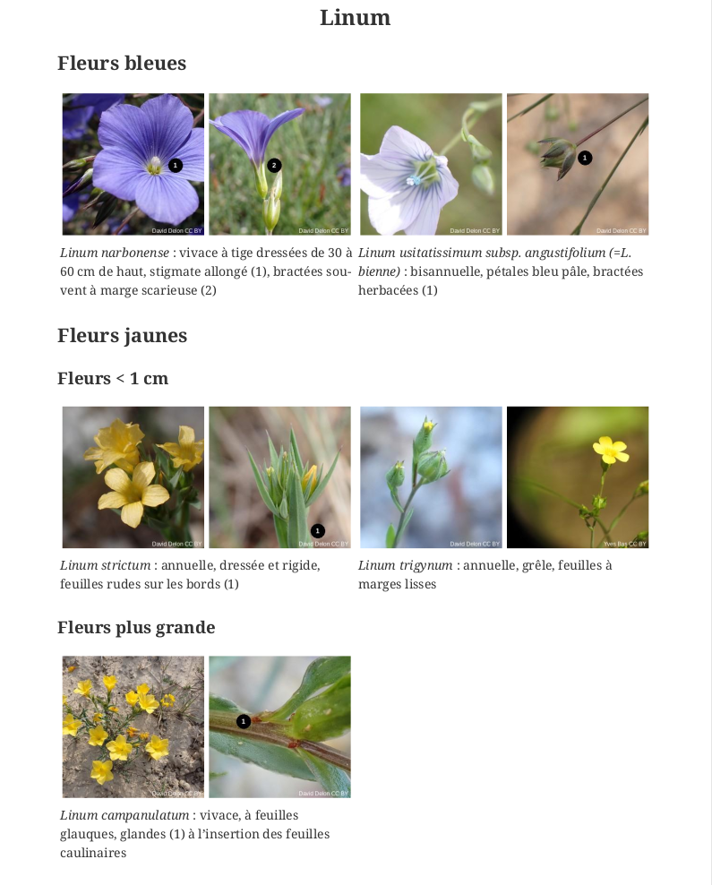

# BioIllustrator

Illustration Fetcher from Inaturalist: Automating Image Collection for Species Determination Keys

## Project Description

This project aims to generate illustrated identification keys from an Asciidoc document, using photos sourced from the Inaturalist website.

## Description du Projet

Ce projet a pour objectif de générer des clés de détermination illustrées à partir d'un document au format Asciidoc, en utilisant des photos provenant du site Inaturalist

### Exemple pour le genre Linum

